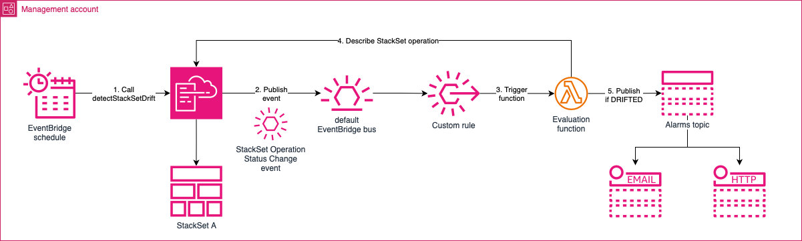

# Automated CloudFormation StackSet drift detection

[](https://opensource.org/licenses/MIT)


Provides a CDK example for automated CloudFormation StackSet drift detection. This event-driven solution allows teams to proactively identify configuration drift across AWS accounts and receive alerts when a StackSet instance(s) drifted from the desired state.

## Getting started

Bellow is an example for how to use the `StacksetDriftDetectionStack` stack.

```python
app = aws_cdk.App()

StacksetDriftDetectionStack(
    app,
    "StacksetDriftDetectionStack",
    env=Environment(
        account=os.environ["CDK_DEFAULT_ACCOUNT"],
        region=os.environ["CDK_DEFAULT_REGION"],
    ),
    props=StacksetDriftDetectionStackProps(
        stackset_names=["ExampleStackSetName"],
        schedule_expression="cron(0 5 ? * 2 *)",
        notification_email_endpoints=["security@examplecorp.com"],
        notification_https_endpoints=["security.webhook.examplecorp.com"],
    ),
)
```

## How it works



1. EventBridge schedule triggers CloudFormation StackSet drift detection based on the provided schedule expression. EventBridge Schedulers support `cron` and `rate` expressions.

2. CloudFormation publishes "StackSet Operation Status Change" events to the default EventBridge bus.

3. A custom EventBridge rule captures the relevant event and forwards it to the Lambda function.

4. The Lambda function fetches the StackSet operation details from CloudFormation and evaluates the its status.

5. If the StackSet operation discovered a DRIFT in one or more of StackSet instances, it will send an alert through the SNS topic.
